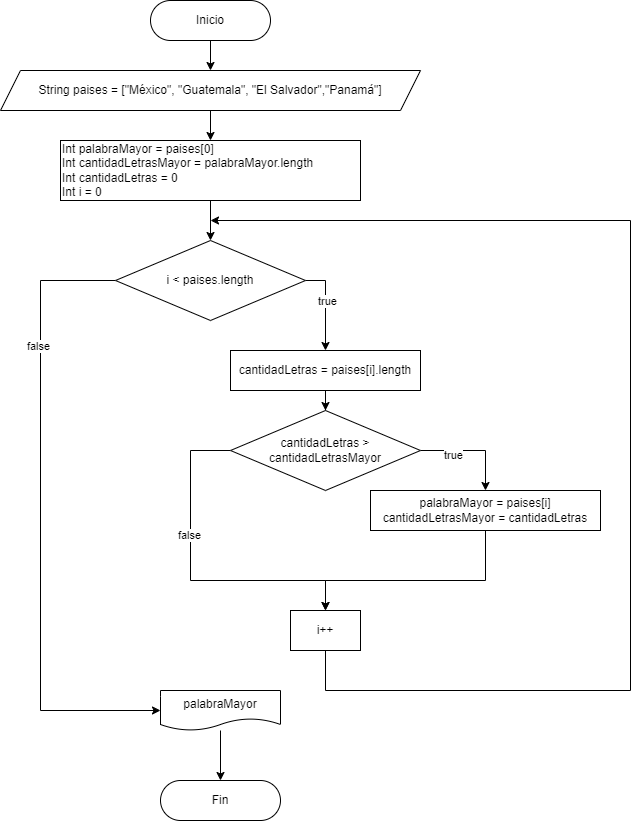

# Actividad 1

Crear un algoritmo para obtener el país con mayor número de letras a partir de un arreglo.

["México", "Guatemala", "El Salvador","Panamá"]

1. Crear diagrama de flujo
2. Crear pseudocódigo
3. Programar el algoritmo en JS

## Pseudocódigo

[Pseudocódigo](https://github.com/ayrtonbolwal/devF_activities_3_POO/blob/main/actividad_1/actividad_1.txt)

```
Inicio
Leer String paises = ["México", "Guatemala", "El Salvador","Panamá"]
    Int palabraMayor = paises[0]
    Int cantidadLetrasMayor = palabraMayor.length
    Int cantidadLetras = 0
    Int i = 0

    desde i < paises.length entonces:
        cantidadLetras = paises[i].length
        si cantidadLetras > cantidadLetrasMayor entonces:
            palabraMayor = paises[i]
            cantidadLetrasMayor = cantidadLetras
        i++
    fin_desde

    imprimir palabraMayor
Fin
```


## Diagrama de Flujo



## Código de Js

[Código de JS](https://github.com/ayrtonbolwal/devF_activities_3_POO/blob/main/actividad_1/script.js)

```
let paises= ["México","Guatemala","El Salvador","Panamá"];

let palabraMayor=paises[0]

let cantidadLetrasMayor=palabraMayor.length;

let cantidadLetras=0;

for(leti=0;i<paises.length;i++){

    cantidadLetras=paises[i].length;

    if (cantidadLetrasLetras >cantidadLetrasMayor){

    palabraMayor=paises[i];

    cantidadLetrasMayor=cantidadLetras;

    }

}

console.log(palabraMayor);
```
